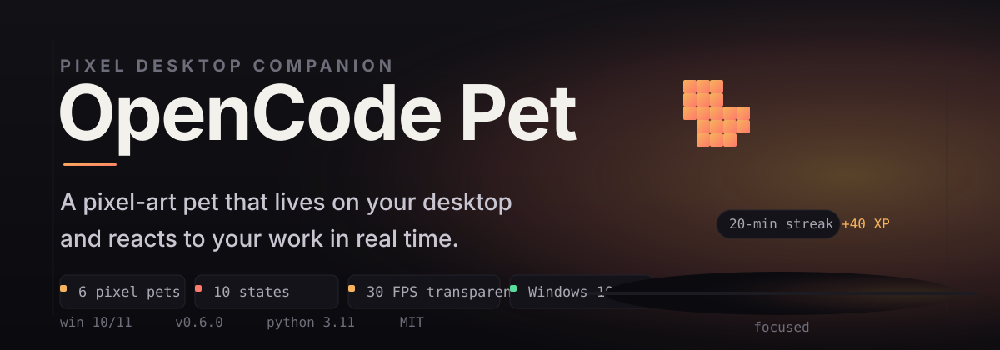
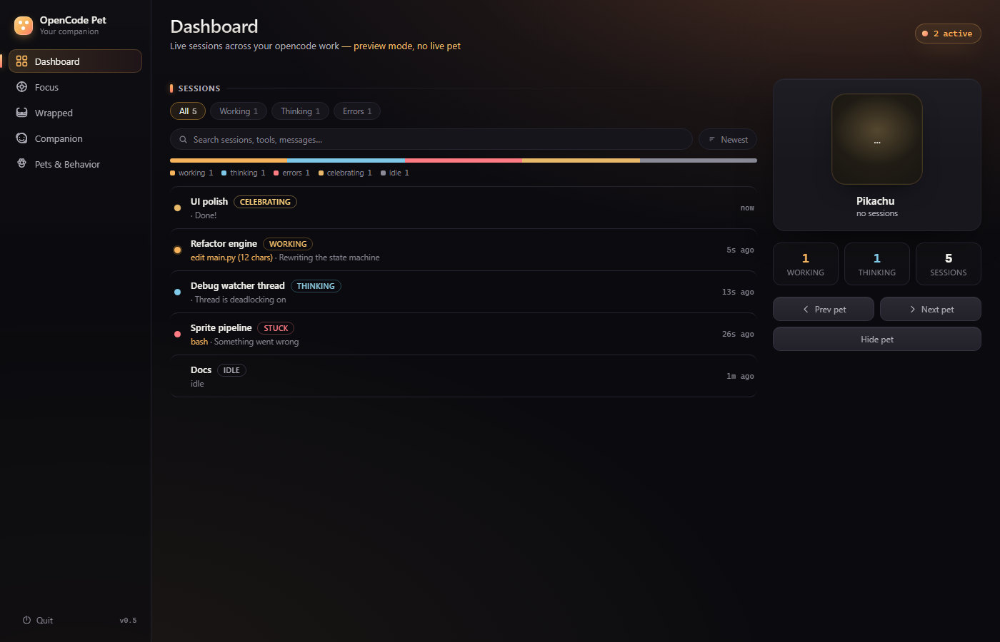
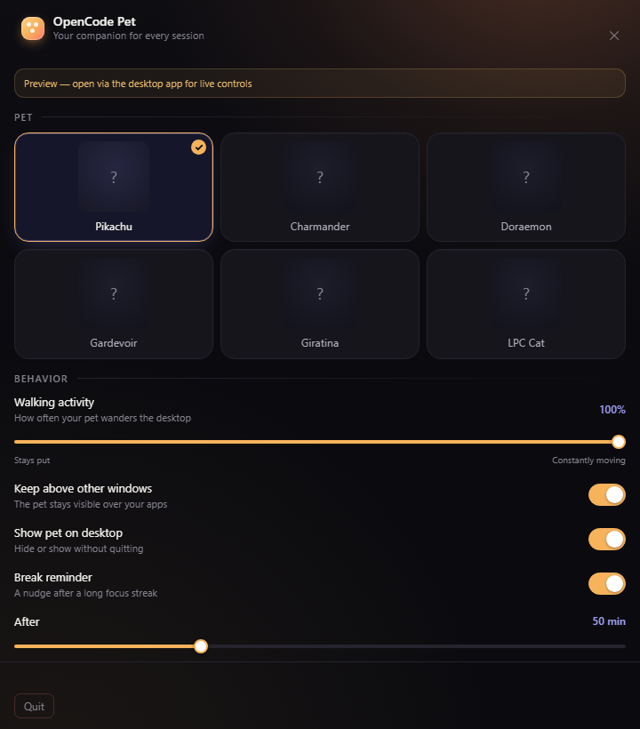
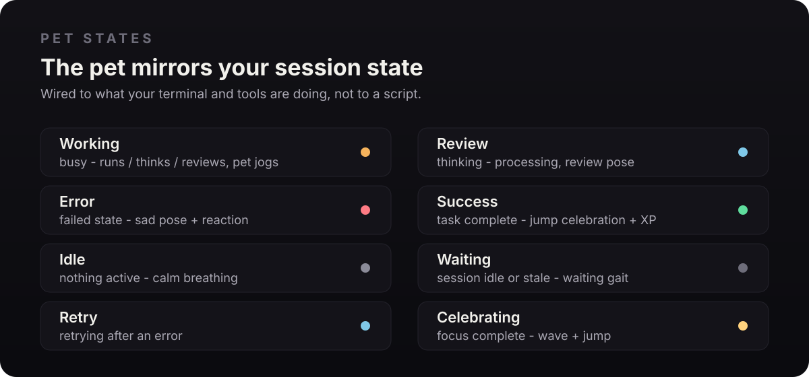
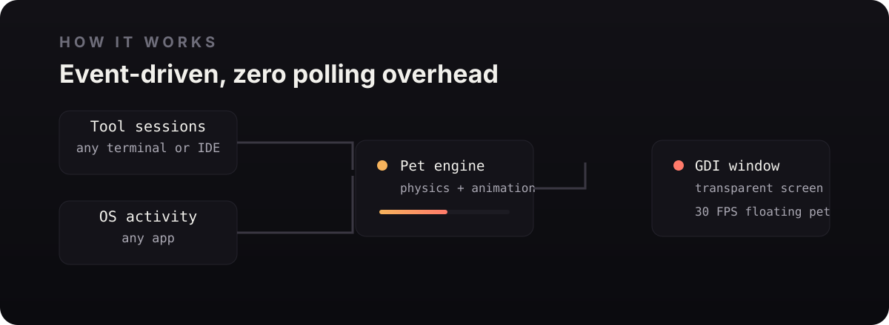

<p align="center">
  
</p>

# OpenCode Pet

**Your pixel-perfect desktop companion for OpenCode.** A pixel-art pet lives at the edge of your screen, watches your sessions, and grows through focused work - no polling, no config beyond one run.

[](https://github.com/iAMv1/opencode-pet/releases/latest)
[](https://www.python.org/)
[](LICENSE)
[](https://github.com/iAMv1/opencode-pet/releases/tag/v0.6.0)

---

## Proof

<p align="center">
  
</p>

<p align="center">
  
</p>

---

## What it is

A non-intrusive pet that reacts to real events - no polling loop. It reads OpenCode session status and OS activity the moment things change, with a safety net so it never misses a beat.

- **Six pixel pets** - real sprite-sheet frame animation
- **Transparent window** - zero background, just the pet at 30 FPS
- **Works with any app** - not just OpenCode
- **Grows with you** - XP, levels and streaks from focused work
- **Daily focus goal** - set a daily focus target (config `goalMin`); the pet
  celebrates with XP + a bubble when you hit it, once per day, and tracks
  your goal streak

---

## Why it is different

| Instead of | OpenCode Pet |
|-----------|--------------|
| Polling overhead | Event-driven updates, instant status change, 3-second safety net |
| Static icons | Live sprite-sheet animation |
| Single bucket | 6 pets, 10 reactive states |
| Code-only | Monitors any app on your system |

---

## Pet states

The pet mirrors the state of your sessions — whatever your terminal and tools are doing right now.

| Session state | Pet does |
|---------------|----------|
| 🏃 Working | Jogs while your tools run, think, or review |
| 🤔 Review | Review pose while processing |
| ❌ Error | Sad pose + a reaction line |
| ✅ Success | Jump celebration, earns XP |
| 💤 Idle | Calm breathing |
| ⏳ Waiting | Waiting gait when sessions go idle |
| 🔁 Retry | Review pose while retrying |
| 🎉 Celebrating | Wave + jump on focus completion |

<p align="center">
  
</p>

---

## How it works

<p align="center">
  
</p>

### Interactions

- Click the pet to make it jump
- Double-click to wave
- Hover for controls
- Drag to move it anywhere

---

## Getting started

**The easy way:** download the prebuilt `.exe`, run it, and the pet appears.

[](https://github.com/iAMv1/opencode-pet/releases/latest/download/OpenCodePet.exe)

Direct: https://github.com/iAMv1/opencode-pet/releases/latest/download/OpenCodePet.exe

**File size:** ~50 MB · **Requirements:** Windows 10/11

**From source:**

```bash
git clone https://github.com/iAMv1/opencode-pet.git
cd opencode-pet
pip install -r desktop/requirements.txt
python desktop/main.py
```

---

## Development

```bash
npm install
pip install -r desktop/requirements.txt
python desktop/main.py
desktop\build.bat    # rebuild the exe
```

## Testing

```bash
python tests/run_all.py
```

- 209 Python tests · 67 UI checks · 65 backend checks · 21 validation tests
- `desktop/` is a package: `main.py` (entry) + `store.py` (config/data),
  `engine.py` (pet), `win32.py` (window), `api.py` (web bridge), `web.py`,
  `sprites.py`, `tray.py`

---

## License

MIT License. See [LICENSE](LICENSE).

---

**Built with ❤️ by [iAMv1](https://github.com/iAMv1)**

⭐ Star this repo if you love having a pet while you code!
